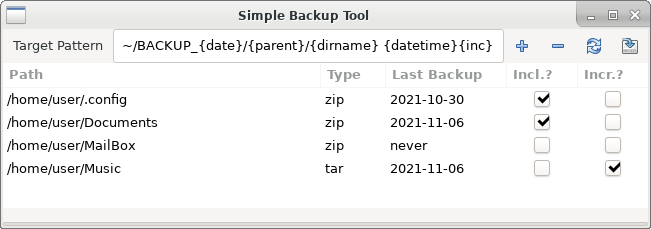

Simple Backup Tool
==================

_2016-2020, Tobias Küster_

This is a very simple tool for creating backups. I made this primarilly for my
personal use and still use it regularly. At first it was just a simple script
and a file with the directories I want to back up, but eventually it got a
proper UI and some more convenience features, but it is still very basic.
For instance, it does not do incremental backups, but it e.g. detects whether
a backup is needed at all based on the changed-dates of the files.

Features
--------
* select directories to be backed up
* select `zip` or `tar` archive (for files that can not be compressed)
* detect whether a directory needs to be backed up again
* create and collect backup archives with current date

Configuration and File Formats
------------------------------
The program is started with `python3 backup_gtk.py`. On the first start,
a configuration file is created in `~/.config/t-kuester/backup.json` holding
the different directories to be backed up as well as some more information.
The file is automatically read when the program is started and updated when it
is closed. The content of the file is explained below.

    {
        "target_dir": "/home/user/backup_{date}",
        "name_pattern": "{parent}/{dirname} {date}",
        "directories": [
            {
                "path": "/home/user/.config",
                "archive_type": "zip",
                "last_backup": "2020-11-07 19:58:41",
                "last_changed": "2020-11-07 19:58:35",
                "include": true
            }, ...
        ]
    }

The `target_dir` is the directory where new backups should be stored. The
`{date}` placeholder can be used for inserting the current date. Similarly, the
`name_pattern` describes the name of the individual archive files within the
backup directory. Again, the `{date}` can be inserted, as can the `{parent}`
directory and the actual `{dirname}` of the directory to be backed up.

The `directories` list shows the individual directories to be backed up. Their
defining feature, of course, is the `path`. Besides that, you can chose whether
to use `zip` or `tar` for each directory (e.g. for a collection of already
compressed pictures or music, using `zip` will barely have any effect and will
just take considerably longer than `tar`). The `last_backup` and `last_change`
fields indicate exactly that, and are set automatically. The `include` field
dictates whether the directory should be included in the next backup and can
either be set manually or derived from the dates of the last backup and change.

User Interface
--------------
As seen in the following figure, the user interface mainly consists of a large
table of all the directories to be backed up and a few buttons and text inputs.
For a description of the individual attributes and palceholders, please refer
to the description of the configuration above.

* use the _Target Dir_ and _Pattern_ entries to define where and how to store
  the created archive files
* use the _Add_ and _Remove_ buttons to select new directories to add to the
  list or to remove entries from the list
* the _Refresh_ button is used to refresh the _last-change_ attribute of the
  directories and to set the _include_ attribute accordingly
* the _Backup_ button is used to create the actual backup
* the table can be sorted by each of the columns, but only the _Type_ and
  _Include?_ columns are editable; valid archive types are `zip` and `tar`
* when the backup has been triggered, the bottom of the UI shows the progress
* the configuration is automatically saved when the UI is closed
